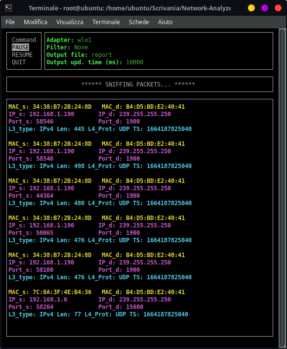
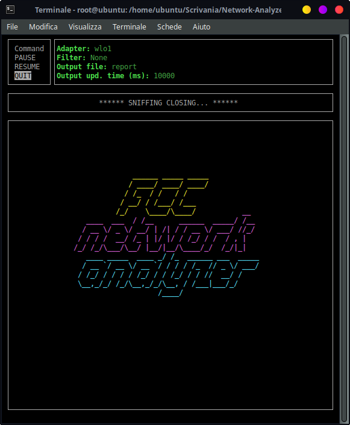

# DOCs

## Network Analyzer Library

`network_analyzer` is a multi-platform library that provides structures and functions to manage a sniffing process,
capable of intercepting incoming and outgoing traffic through the network interfaces of a computer.<br>
The sniffed network adapter is set in promiscuous mode: packets are collected, together with their IP addresses,
ports and protocol type.

Periodically, a textual report (in `.xml` and `.md` formats) is generated, describing a synthesis of the
observed events.<br>
The traffic is divided in flows and the library shows for each of the network address/port pairs,
the protocol that was transported, the cumulated number of bytes transmitted, the timestamp of the
first and last occurrence of information exchange.

A `Sniffer` struct is exposed: it is the main object that can be initialized and that offers methods
to control the sniffing process (`pause`, `resume`, `stop`) and methods to establish a connection with an application (`subscribe`).

While the sniffer is running, packets are collected and shown as `NAPacket` instances, which include informations such as
MAC and IP addresses, level three and the transported protocols, timestamps and ports.

Moreover, the library exposes other structures representing the sniffer state (`NAState`), the available filters (`Filter`) and the possible errors (`NAError`), along with a `Message` that is transmitted into a communication channel between sniffer and application.

Finally, a sample application is provided to demonstrate how to properly use the library.

### network_analyzer::sniffer

```rust
pub fn get_adapter(adapter: u8) -> Result<Device, NAError>
```

Returns the nth `Device` of the device list, or an error if it doesn't exist.

This function takes an u8 representing the index associated to a device within the network device list and returns a
Result, containing either a proper pcap `Device` object, or a `NAError`

### network_analyzer::sniffer::Sniffer

The struct `Sniffer` initializes the sniffing and reporting process, by

* Finding the `pcap::Device` associated to the given `adapter`
* Properly setting up (in promisc mode) and activating a `pcap::Capture` on the given `adapter`.
* Associating (if possible) the given `filter` string to a `network_analyzer::Filter` tag
* Creating a `network_analyzer::channel::SnifferChannel` to transfer informations from the
  internal threads to the subscribed one (where the Sniffer is created).
  Moreover, the struct `Sniffer` is responsible for the initialization of two threads:

1) <i>timer_thread</i>: while the sniffer isn't paused/stopped, every `update_time` milliseconds, updates the sniffing
   report contained in a `output` (.xml and .md) file
2) <i>sniffing_thread</i>: while the sniffer isn't paused/stopped, waits for the capturing of a packet, takes the
   captured `pcap::Packet`, transforms it in a readable `NAPacket`, filters it (following the given `filter`) and
   eventually transfers it to the subscribed thread(s) via `SnifferChannel`.
   The `Sniffer` also implements the `Drop` trait, so that the `drop(&mut self)` function waits for the proper
   termination
   of the two threads initialized by the struct.

```rust
pub fn new(adapter: u8, output: String, update_time: u64, filter: String) -> Result<Self, NAError>
```

Creates a new `Sniffer` object given four parameters (network adapter to sniff (u8), output filename (String), output
file update time (u64), filter (String)) or returns an `NAError`.

```rust
pub fn pause(&mut self)
```

Pauses both sniffing and reporting threads within the `Sniffer` struct
This function performs different tasks in order to correctly pause the sniffing process:

* Sets the sniffer's `NAState` field to `NAState::PAUSED`
* Sends a 'state change message' onto the `SnifferChannel`
* Forces the writing of a report before the pause

 ```rust
pub fn resume(&mut self)
```

Resumes both sniffing and reporting threads within the `Sniffer` struct
This function performs different tasks in order to correctly resume the sniffing process:

* Sets the sniffer's `NAState` field to `NAState::RESUMED`
* Sends a 'state change message' onto the `SnifferChannel`
* Notifies both sniffing and reporting threads in wait on the `Sniffer`'s condition variable

```rust
pub fn stop(&mut self)
```

Forces the exiting of both sniffing and reporting threads within the `Sniffer` struct
This function performs different tasks in order to terminate of the sniffing process:

* Sets the sniffer's `NAState` field to `NAState::STOPPED`
* Sends a 'state change message' onto the `SnifferChannel`
* Notifies both sniffing and reporting threads (if paused, otherwise the notification is lost)

```rust
pub fn subscribe(&mut self) -> Receiver<Message>
```

Returns a `Receiver<Message>`.<br>
It can be used to receive all the updates from the `Sniffer`.

This method tries to acquire the inner Mutex, so it blocks until it is free.
Then it calls the `subscribe()` function of the `SnifferChannel` and returns
the new receiver.

```rust
pub fn get_state(&self) -> NAState
```

Returns the current state of the sniffer.

This method tries to acquire the inner Mutex, so it blocks until it is free.
Then the NAState is cloned and returned.

### network_analyzer::sniffer::NAPacket

The struct `NAPacket` describes the packet sniffed and keeps the most relevant network information like:

* source and destination MAC addresses
* level 3 protocol type
* source and destination level 3 adresses (IPv4 or IPv6)
* packet length (in bytes)
* transported protocol
* source and destination ports (if any)
* timestamp.

Moreover, it is also responsible for:

1) formatting the `NAPacket` information to be printed out better on the screen
2) filtering the `NAPacket` using a filter tag defining transported protocol, IP addresses, ports or packet
3) casting integers extracted from pcap `Packet` library into MAC addresses, IP addresses (v4 and v6) and level 3 and 4
   transported protocols.

```rust
pub fn new(pcap_packet: Packet) -> Self
```

Creates a new `NAPacket` object starting from a `Packet` of `pcap` library.

This function accesses specific bytes of the `pcap::Packet` object containing relevant information
such as transported protocols, source and destination ports, addresses and so on which are casted using appropriate
functions.

```rust
pub fn to_string_mac(&self) -> String
```

Formats the `NAPacket` source and destination MAC addresses.

This function returns a `String` containing source and destination MAC addresses properly formatted to appear on the
terminal.

```rust
pub fn to_string_endpoints(&self) -> String
```

Formats the `NAPacket` source and destination level 3 addresses (IPv4 or IPv6).

This function returns a `String` containing source and destination addresses properly formatted to appear on the
terminal.

Since IPv6 addresses can be longer then IPv4 ones, they cannot appear in the same line
otherwise can generate issues when displayed on the terminal.
It evaluates the space to put between the addresses based on their length, and then inserts it in the middle of the two.

```rust
pub fn to_string_ports(&self) -> String
```

Formats the `NAPacket` source and destination ports.

This function returns a [`String`] containing the source and destination ports properly formatted to appear on the
terminal.

```rust
pub fn info(&self) -> String
```

Formats the `NAPacket` transported protocols, length and timestamp.

This function returns a `String` containing the

* protocols transported
* length
* timestamp

properly formatted to appear on the terminal.

```rust
pub fn filter(&self, filter: Filter) -> bool
```

* Returns `true` if the given `NAPacket` passes the given filter
* Returns `false` if the given `NAPacket` doesn't pass the given filter
  This function receives a `Filter` tag and checks if the receiver (`NAPacket`)
  passes or not the filter.
  <br></br>
  <i>Example:</i>

- The filter is `Filter::IP(192.168.1.1)` => if a 192.168.1.1 ip address is found
  to be either the level 3 source or destination of the packet, `true` is returned.
- The filter is `Filter::ARP` => if the level three type of the packet is found to be
  "ARP", `true` is returned.
- The filter is `Filter::None` => `true` is returned whatever packet is inspected

### network_analyzer::sniffer::na_packet::protocols

```rust
pub(crate) fn to_mac_address(p: &[u8], start: usize) -> String
```

Casts a sequence of bytes into a MAC address.

This function takes a `&[u8]` representing a `Packet` of `pcap` library and a `usize` as index from which start to
extract the MAC address and
returns a `String` containing the MAC address properly formatted.

```rust
pub(crate) fn to_ip_address(p: &[u8], start: usize) -> String
```

Casts a sequence of bytes into an IPv4 address.

This function takes a `&[u8]` representing a `Packet` of `pcap` library and a `usize` as index from which start to
extract the IPv4 address and
returns a `String` containing the IPv4 address properly formatted.

```rust
pub(crate) fn to_ipv6_address(p: &[u8], start: usize) -> String
```

Casts a sequence of bytes into an IPv6 address.

This function takes a `&[u8]` representing a `Packet` of `pcap` library and a `usize` as index from which start to
extract the IPv6 address and
returns a `String` containing the IPv6 address properly formatted.

```rust
pub(crate) fn to_transported_protocol(prot_num: u8) -> String
```

Converts an integer value into the corresponding transported protocol.

This function takes a `u8` representing the value written inside the protocol field of a pcap `Packet` and returns
a `String`
containing the actual transported protocol's name.

The range of admissible values ranges from 1 to 142 (extremes included) excluding 43, 44, 51, 60 and 135.
All the values outside this range will return a `String` containing "Unknown".

```rust
pub(crate) fn to_level_three_protocol(prot_num: u16) -> String
```

Converts an integer value into the corresponding level 3 protocol.

This function takes a `u16` representing the hexadecimal value written inside the 2 bytes of the protocol field of a
pcap `Packet` and returns a `String`
containing the actual level 3 protocol's name.

The list of the accepted hexadecimal values is: 0x0800, 0x86DD, 0x0806, 0x8035, 0x0842, 0x22F0, 0x22F3, 0x22EA, 0x6002,
0x6003, 0x6004
0x809B, 0x80F3, 0x8100, 0x8102, 0x8103, 0x8137, 0x8204, 0x8808, 0x8809, 0x8819, 0x8847, 0x8848, 0x8863, 0x8864, 0x887B,
0x888E, 0x8892, 0x889A,
0x88A2, 0x88A4, 0x88A8, 0x88AB, 0x88B8, 0x88B9, 0x88BA, 0x88BF, 0x88CC, 0x88CD, 0x88E1, 0x88E3, 0x88E5, 0x88E7, 0x88F7,
0x88F8, 0x88FB, 0x8902,
0x8906, 0x8914, 0x8915, 0x891D, 0x893A, 0x892F, 0x9000, 0xF1C1.

All the values outside this range will return a `String` containing "Unknown".

```rust
pub(crate) fn get_ipv6_transported_protocol(p: &[u8], (next_header_index, remaining_size): (usize, usize)) -> (String, usize)
```

Slides the IPv6 headers until it finds another protocol, so it returns a pair
composed by the transported protocol's name and the index of the first byte
of its header.

This function gets two arguments:

* The packet to be processed as an array of u8.
* A pair composed by the "next header index" which refers to the first byte
  of the next header to be processed and by the "remaining size" which is the
  remaining dimension (in bytes) of the header.

The function slides the IPv6 header until it finds the "Next Header" field,
if it indicates an IPv6 Extension Header, it calculates the remaining length
of the first header and then calls again the function (in a recursive call),
otherwise it calls `to_transported_protocol(prot_num)` and returns.

It panics if the index exceed the array length.

### network_analyzer::sniffer::NAError

The struct `NAError` defines custom error messages.

It contains a message of type `String` that includes a brief description of the error occurred, depending on the
function
that calls it.
It implements Display and Error traits.

```rust
pub(crate) fn new(msg: &str) -> Self
```

Creates a new `NAError` object starting from a &str msg received as parameter.

### network_analyzer::sniffer::Filter

Enumerates the different filtering categories offered by the network_analyzer library.
The filter to be used is defined as CLI argument, by passing an appropriate filter string preceeded by flag -f (--filter
as long notation) [see Application > CLI Arguments section]

It also implements the `ToString` trait, allowing a correct transformation of `Filter`'s
tag (and possible detail) into a proper string representation.
<br></br>
<i> Example </i>

* `Filter::IP(192.168.1.1)` is converted into "IP 192.168.1.1"
* `Filter::Port(443)` is converted into "port 443"

```rust
pub fn get_filter(filter: &String) -> Result<Filter, NAError>
```

Associates a received string to a `Filter` (if possible), or returns an `NAError`.
This function associates a string to a filter, by analyzing the correctness of the passed parameter.
<br></br>
<i>Example</i>:

* "ipv4" can be associated to a `Filter::IPv4` filter
* "192.168.1.1" can be associated to  `Filter::IP(String)`
* "2001:db8::2:1" can be associated to a `Filter::IP(String)`
* "foo.192 foo" cannot be associated to any filter

### network_analyzer::sniffer::stats::Stats

The `Stats` type.

It is used to store information about the (ISO/OSI) level four packet flow,
needed to produce the sniffer report.<br>
This type implements the `Debug` and `Clone` traits.

It contains:

* The pair of socket
* The level three protocol's name
* The transported protocol's name
* The flow's total number of bytes
* The timestamp of the first packet received
* The timestamp of the last packet received

```rust
pub(crate) fn new(packet: NAPacket) -> Self
```

Creates a new `Stats` from a `NAPacket`.

This method extracts the needed field from the packet and populate
the new object, by using the timestamp twice, both for the first
and last packet fields.

It is typically used by passing as argument the first packet of a flow.

```rust
pub(crate) fn produce_report(file_name_md: String, file_name_xml: String, packets: Vec<NAPacket>, stats: Vec<Stats>) -> Vec<Stats>
```

Produces two report files (<i>.xml</i> and <i>.md</i>) and returns the updated
vector of `Stats`.

The function takes as argument two file name (one for each format), a vector of
packets and a vector of (old) stats; these are used to produce an updated version
of the stats by calling the function `produce_stats(stats, packets)`.<br>
Then, it creates the files and writes them by using the `writeln!` macro.<br>
At the end, it returns the updated stats.

It panics if it is unable to write correctly the files and show the message
`"Unable to write the report file!"`.

```rust
fn produce_stats(mut stats: Vec<Stats>, packets: Vec<NAPacket>) -> Vec<Stats>
```

Produces an updated version of the stats and returns a vector of `Stats` objects.

This function takes as argument a vector of old stats and a vector of packets
to be processed and added.

It slides the packets, checks if its pair of socket is already recorded
in the stats, then it updates the relative `Stats` object by adding the
number of bytes and replacing the last packet timestamp.<br>
Otherwise, it creates a new object by calling the `new(packet)` static
function of `Stats`.

At the end, it returns the updated vector of stats.

### network_analyzer::sniffer::channel::SnifferChannel

The `SnifferChannel` type.

It is used to let the sniffer communicate with its subscribers by sending messages.<br>
It contains a vector of `Sender<Message>`, one for each subscriber.

```rust
pub(crate) fn new() -> Self
```

Creates a new `SnifferChannel` object and populate it with an empty array of senders.

```rust
pub(crate) fn subscribe(&mut self) -> Receiver<Message>
```

Creates a new communication channel and returns the receiver.

This method use the `std::sync::mpsc::channel()` function to create
a `Sender`, which will be added to the `SnifferChannel` and a `Receiver`,
which will be returned to the subscriber.

```rust
pub(crate) fn send(&mut self, message: Message)
```

Sends a `Message` to all the subscribers.

The method slides the senders vector and checks if each of them is still valid.<br>
It calls the `send(message)` method of the `Sender` that attempts to send the
message and returns an error if the `Receiver` has been already deallocated.<br>
In this case, the sender is removed from the vector.

### network_analyzer::sniffer::channel::Message

The `Message` type.

It is an enumeration that contains the message sent in the `SnifferChannel`,
that can be either a `NAError`, a `NAState` or a `NAPacket`.<br>
This type implements the `Clone` trait.

## Application

### Pictures of FCC Network Analyzer v1.0, in tui mode




### CLI Arguments:

* `--adapter (-a):` u8 number (default 1) associated to an adapter according to a list that can be shown passing `-l`
  or `--list-adapters` as argument
* `--output (-o)`: String (default "report") defining the name of the output file (.md / .xml where the report is
  written)
* `--update-time (-u)`: u64 number (default 10000) defining the output file update time (in milliseconds)
* `--filter (-f)`: String (default "None") defining a packet filter

  > <b>Available filter strings:</b>
  > * "IPv4"  - filters by level 3 type (only IPv4 packets)
  > * "IPv6"  - filters by level 3 type (only IPv6 packets)
  > * "ARP"  - filters by level 3 type (only ARP packets)
  > * "<i>specific IP</i>" (v4 or v6) either as source or destination (<i> Example: "192.168.1.1" or "2001:db8::2:
      1"</i>)
  > * "<i>port</i>"  - filters only packets having as source or destination port the given one (<i> Example: "443"</i>)
  > * "><i>length</i>"  - filters only packets whose length is greater than the given length (in bytes) (<i> Example: ">
      50"</i>)
  > * "<<i>length</i>"  - filters only packets whose length is less than the given length (in bytes) (<i> Example: "<
      50"</i>)
  > * ">=<i>length</i>"  - filters only packets whose length is greater or equal to the given length (in bytes) (<i>
      Example: ">=50"</i>)
  > * "<=<i>length</i>"  - filters only packets whose length is less or equal to the given length (in bytes) (<i>
      Example: "<=50"</i>)
  > * "=<i>length</i>"  - filters only packets whose length is equal to the given length (in bytes) (<i> Example: ">
      =50"</i>)
* `--tui (-t)`: bool (default "false") enabling the `tui mode`

* `--list-adapters (-l)`: bool (default "false") showing the list of available network adapters to be sniffed, together
  with the associated index.

### Functions explanation

```rust
fn notui_show_commands()
```

Prints on the terminal the list of commands.

These commands can be used to control the sniffing process and are:

* P to Pause
* R to Resume
* Q to Quit

This function uses the println! macro and waits for 3 seconds before returning.<br>
In this way, the user can correctly visualize the list, independently of the following
operations.<br>
At the end, a "sniffing start" message is shown.

```rust
fn tui_init(adapter: &str, filter: &Filter, output: &str, update_time: u64) -> Window
```

Initializes the GUI by defining the main window with its dimensions, the boxes inside it
with their positions and format the parameters received by putting them inside the top right box.

Moreover, if running on MacOS or Linux, it calls the resize command of the terminal to define its dimensions.

This function receives as parameters:

1) adapter &[str] containing the network adapter
2) filter &[Filter] containing the filter chosen, if any
3) output path &[str] containing the path where the file will be saved
4) update time [u64]

```rust
fn state_win_init() -> Window
```

Initializes the box containing the execution state of the program, by defining its dimensions and positions.

It returns a [Window] with a new box inside that as default contains "*** SNIFFING PACKETS ***".

```rust
pub fn print_packet(p: NAPacket, tui_window: Option<&Window>, tui_mutex: Arc<Mutex<()>>)
```

Prints a received `NAPacket`:

* on a given `pancurses::Window` according to a proper format if the application is run in `--tui` mode
* to the stdout (by means of the `Display` trait implemented by the struct `NAPacket`) in the other cases
  The passed parameters are:

1) `NAPacket` to print
2) Optional `pancurses::Window` if the application is run in `--tui` mode (None otherwise)
3) `Arc<Mutex<()>>` to synchronize the writing operations on the tui (in case of `--tui` mode)

```rust
fn print_state(state_window: Option<&Window>, state: &NAState, tui_mutex: Arc<Mutex<()>>)
```

Refreshes the state window with the current `Sniffer`'s state
Everytime a 'state change message' is sent from the Sniffer object, the tui's state window is refreshed

```rust
fn print_error(sub4: Option<&Window>, error: NAError, tui_enabled: bool, tui_mutex: Arc<Mutex<()>>)
```

Prints an `NAError` in different ways depending if the TUI is enabled or not.

This function receives as parameters:

1) `Option<&Window>` that contains the main Window or None if the TUI is not enabled
2) `NAError` object containing the actual error to print
3) `bool` tui_enabled that specifies if the TUI is enabled or not
4) `Arc<Mutex<()>>` to manage the use of `printw` function.
   If the TUI is enabled, the function will:
5) Lock the mutex
6) Print the error inside the state box of the main window
7) Release the lock

Otherwise, if TUI is not enabled, it prints the error using the `println!` macro.

```rust
fn enable_commands(sniffer: &mut Sniffer, main_window: Option<Window>, state_window: Option<Window>, tui: bool, tui_mutex: Arc<Mutex<()>>)
```

Calls `tui_event_handler(...)` or `notui_event_handler(...)` depending on the tui boolean
argument received.

This function starts the main loop that listen to the tui or to the terminal stdin.<br>
It accept as parameters a `sniffer` reference and a `tui` boolean.<br>
The other parameters are "optional" and are used only in case of a tui based call.<br>
These are the `main_window` and the `state_window` which are of type `Option<Window>` and a
`tui_mutex`, used to synchronize the tui updates.

```rust
fn tui_event_handler(sniffer: &mut Sniffer, main_window: Option<Window>, state_window: Option<Window>, tui_mutex: Arc<Mutex<()>>)
```

1) Defines the commands to be shown in the tui's command window
2) Prints the command window and enables the arrow keys
3) Waits in loop (through a blocking getch) for user user commands (arrow key pressure / enter)
4) Calls the function associated to the selected command

```rust
fn notui_event_handler(sniffer: &mut Sniffer)
```

Manages the user interaction when the TUI is not enabled.

This function performs the following operations:

1) Waits in loop (through a blocking read_line) for user commands (keys p,q,r pressure / enter)
2) Calls the function associated to the selected command and prints the new execution state.
   If the key pressed is not defined, "Undefined command" will be printed and the state won't change.

```rust
fn print_closing(window: &Window, tui_mutex: Arc<Mutex<()>>)
```

Prints the application logo on a given `pancurses::Window`

### main

The first action performed by the main is the parsing of the main arguments (via `Parser` derived by `clap` library).

In `--list-adapters (-l)` mode, only the list of available network adapters (together with the associated index) is
shown.

Otherwise, the main:

1) checks if the `--tui (-t)` mode has been activated
2) creates a `network_adapter::sniffer::Sniffer` object, properly configured by passing the main arguments as parameters
   to the constructor
3) if the `tui mode` is enabled, properly initializes the tui layout and content on the terminal
4) subscribes to the `SnifferChannel` associated to the `Sniffer` object, in order to listen for packets, state change
   messages or errors (`network_analyzer::sniffer::Message`).

The last point is implemented through a secondary thread, the `observer_thread`, that listens
to the `Receiver` object generated by the subscription and loops on it, waiting for a new message.<br>
When the `recv()` blocking method of the receiver returns, the thread calls `print_packet(...)`,
`print_error(...)` or `print_closing(...)` if the state received is `NAState::STOPPED`.<br>
These methods will print the message on the stdout or on the tui (if enabled).

Then, a new loop is initialized in the main thread, that listens for inputs and, in the end,
it waits for the termination of all the secondary threads, before closing.
